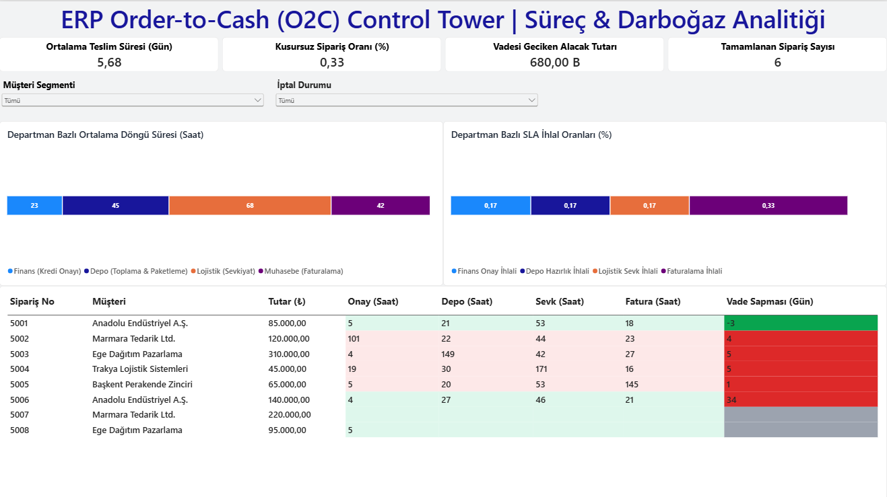

# 🔄 ERP Order-to-Cash (O2C) Process Mining & Bottleneck Analytics

Kurumsal satış operasyonlarında (Order-to-Cash) departmanlar arası operasyonel darboğazları, SLA (Hizmet Seviyesi Taahhüdü) ihlallerini ve nakit akışını riske atan gecikmiş tahsilatları analiz etmek amacıyla geliştirilmiş süreç analitiği ve iş zekası çalışması.



---

## 📌 Proje Özeti ve İş Problemi

Order-to-Cash (O2C); bir müşterinin sipariş vermesinden siparişin onaylanmasına, depodan toplanmasına, sevk edilmesine, faturalandırılmasına ve nihai nakit tahsilatına kadar uzanan uçtan uca satış operasyonudur.

Bu süreçteki departmanlar arası koordinasyon eksiklikleri ve onay kuyrukları:
* **Müşteri Memnuniyetsizliğine:** Sipariş teslim sürelerinin (Lead Time) kontrolsüz uzamasına,
* **Sermaye Tutsaklığına:** Faturaların gecikmesi veya vadesi geçen alacakların (Overdue Receivables) birikmesiyle nakit akışının bozulmasına neden olur.

Bu projenin amacı, kurumsal ERP işlem kayıtları üzerinden aşama bazlı darboğazları tespit etmek, departmanların SLA ihlal oranlarını ölçmek ve yönetime aksiyon odaklı analitik içgörüler sunmaktır.

---

## ⚙️ BPMN 2.0 Süreç Mimarisi

Aşağıdaki akış şeması, analiz edilen 5 operasyonel kulvarı (Swimlane), karar kapılarını ve her aşama için tanımlanan resmi SLA hedeflerini göstermektedir:

```mermaid
flowchart TD
    Start([Müşteri Siparişi Girişi]) --> Step1[1. Satış: ERP Sipariş Kaydı]
    
    subgraph Finans_Kulvari [Finans Departmanı - SLA: 24 Saat]
        Step1 --> Gateway1{Kredi Limiti Yeterli mi?}
        Gateway1 -- Hayır --> Cancel[Sipariş Donduruldu / İptal]
        Gateway1 -- Evet --> Step2[Kredi Onayı Verildi]
    end

    subgraph Depo_Kulvari [Depo Operasyonu - SLA: 48 Saat]
        Step2 --> Step3[WMS Toplama ve Paketleme]
    end

    subgraph Lojistik_Kulvari [Lojistik / 3PL - SLA: 72 Saat]
        Step3 --> Step4[Taşıyıcıya Teslim & Sevkiyat]
        Step4 --> Step5[Müşteriye Teslimat - POD]
    end

    subgraph Muhasebe_Kulvari [Muhasebe & Finans - SLA: 24 Saat / Sözleşme Vadesi]
        Step5 --> Step6[e-Fatura Düzenlendi]
        Step6 --> Step7{Vade İçinde Tahsilat Sağlandı mı?}
        Step7 -- Evet --> EndSuccess([Tahsilat Kapatıldı - Süreç Başarılı])
        Step7 -- Hayır --> Alert[Vade Aşımı Uyarısı & Hukuki Takip]
    end

    classDef default fill:#f8fafc,stroke:#334155,stroke-width:1px;
    classDef alert fill:#fee2e2,stroke:#ef4444,stroke-width:2px;
    classDef success fill:#dcfce7,stroke:#16a34a,stroke-width:2px;
    class Cancel,Alert alert;
    class EndSuccess success;